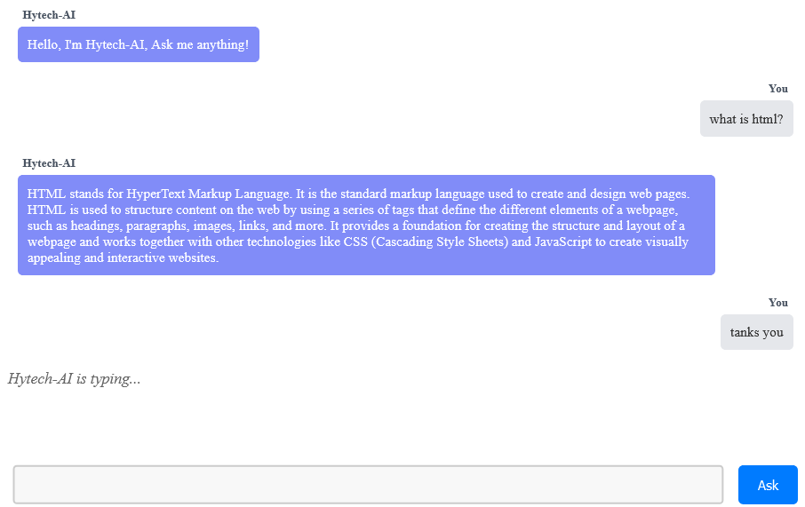

# ReactJS Chatbot OpenAI

This simple ReactJS project that I created is an AI Chatbot that uses apiKey from OpenAI.

## Installation
```sh
cd react-chatgpt-openai
npm install

//add what is needed
npm i react-markdown
```

## Components Only

Go to the `src` folder and copy the `components` folder and its contents to your react project.

**Impport components**

```sh
```
**Call Component**

```sh
<HyTechAi apiKey="your apiKey" />
```
**Code Example (App.js)**
```
import './App.css';

function App() {
  return (
    <>
      <HyTechAi apiKey="your apiKey" />
    </>
  );
}

export default App;
```
## Customization

| Atribute | Description |
|:---------|:-----------|
|apiKey=""|You can get apiKey on the official openAI website: <a href="https://openai.com/">GET API KEY</a>|
|aiModel=""|Required to use GPT-3 or GPT-4 models: <a href="https://platform.openai.com/docs/models/overview">View Models</a>|
|aiPrompt=""|You can give commands to your bot|
|aiName=""|Change your bot name|
|aiMessage=""|Greet the user before asking a question|
|senderName=""|Change user name|
|typingLoad=""|Changing text Bot is typing...|
|buttonText=""|Change the submit button text|

## Example Full Customization

```sh

```
## Change Appearance
You can change/customize the appearance in the `style.css` file


I didn't encrypt this repository for you to develop in it. If there are problems, please tell me the problem and I will fix it immediately, don't forget to give a star.

Hope it is useful,
Warm greetings from me.


